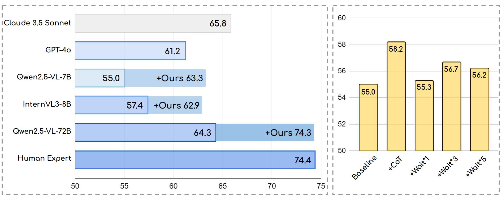
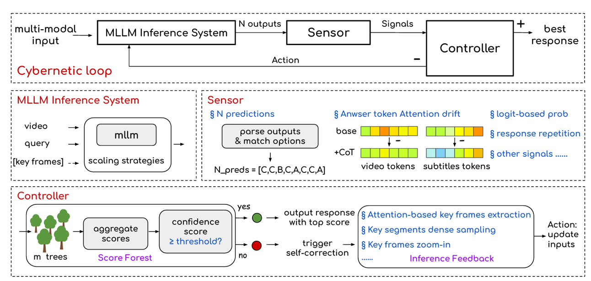

<br />
<p align="center">
  <h1 align="center">CyberV: Cybernetics for Test-time Scaling  <br> in Video Understanding</h1>


<h3 align="center"> Jiahao Meng, Shuyang Sun, Yue Tan, Lu Qi, Yunhai Tong, Xiangtai Li, Longyin Wen </h3>

<div align="center">
[](https://arxiv.org/abs/2506.07971)
[](https://www.youtube.com/watch?v=OxelhjjP01c)
</div>

<div align="center">
  
</div>

<div align="center"> Performance on VideoMMMU Benchmark.</div>

## 📖 Abstract

In this work, we present **CyberV**, a cybernetic system consisting of **an MLLM Inference System, a Sensor and a Controller**. Specifically, the sensor monitors forward processes of the MLLM and collects intermediate interpretations, such as attention drift, then the controller determines when and how to trigger self-correction and generate feedback to guide the next round. This test-time adaptive scaling framework enhances frozen MLLMs without requiring retraining or additional components. Experiments demonstrate significant improvements: CyberV boosts Qwen2.5-VL-7B by 8.3\% and InternVL3-8B by 5.5\% on VideoMMMU, **surpassing the competitive proprietary model GPT-4o**. When applied to Qwen2.5-VL-72B, it yields a 10.0\% improvement, achieving performance even **comparable to human experts**. Furthermore, our method shows consistent gains on general-purpose benchmarks like VideoMME and WorldSense, highlighting its effectiveness and generalization capability in making MLLM more robust and accurate for dynamic video understanding.

<div align="center">
  
</div> 


## 🛠️ Quick Start

### Installation

``` bash
# Create a new environment with Conda
conda create -n cyberv python=3.10
conda activate cyberv
# Install Packages
cd /path/to/CyberV
pip install -r requirements.txt
pip install flash_attn
```

### Data Preparation

Benchmarks: 

- [VideoMMMU](https://huggingface.co/datasets/lmms-lab/VideoMMMU)

- [VideoMME](https://huggingface.co/datasets/lmms-lab/VideoMMMU)

- [WorldSense](https://huggingface.co/datasets/honglyhly/WorldSense)

You can download the audio transcripts (subtitles) from [huggingface](https://huggingface.co/datasets/marinero4972/CyberV_ASR/tree/main). The audio transcripts are extracted using [Faster-Whisper-Large-v3](https://github.com/SYSTRAN/faster-whisper).


### Model Preparation

We use [Qwen2.5-VL-7B](https://huggingface.co/Qwen/Qwen2.5-VL-7B-Instruct), [Qwen2.5-VL-72B](https://huggingface.co/Qwen/Qwen2.5-VL-72B-Instruct) and [InternVL3-8B](https://huggingface.co/OpenGVLab/InternVL3-8B) in our experiments.


### Inference

To reproduce the results of **Qwen2.5-VL-7B**, simply run:

```bash
bash ./scripts/test_videommmu.sh
```

**Note:** Before running the script, make sure to update the your working directory, data path and model path in the `.sh` file.

For other models or benchmarks, please refer to the corresponding scripts provided in the `scripts/` directory.


